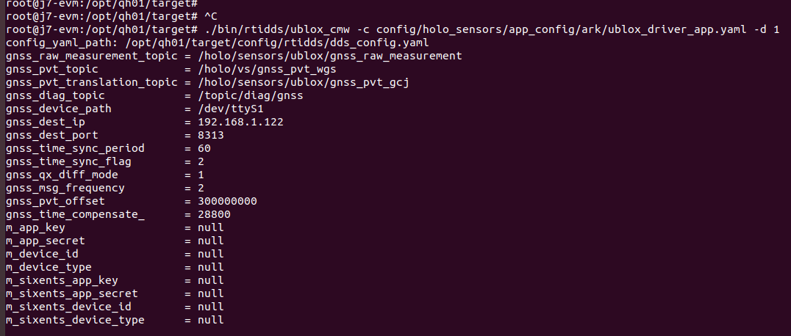

# QH01 OTA(ADCC)使用介绍

**责任人列表**

OTA架构图参考：[QH01 OTA High Level
Design](https://holomatic.feishu.cn/docx/JofwdGKqMoxYPnxa5nbcdztBn0f)

  ----------- ------------------- --------------- ---------------
              列表                owner           backup
  TDA4        upgradeMgr          \@韦恩-袁宪彬   
              test\_zmq\_req      \@韦恩-袁宪彬   
              诊断协议栈          \@艾伦-钱鹏鹏   
              mcuMgr              \@鲍勃-刘轶川   
              tda4\_update\_mcu   \@鲍勃-刘轶川   
              Ota tda4启动脚本    \@王洋          \@韦恩-袁宪彬
  J3          Ota j3启动脚本      \@王洋          \@格林-费明华
              j3Update            \@格林-费明华   
  MCU         mcuUpdate           \@格里芬-洪浩   
  镜像+加签                       \@王洋          
                                                  
  ----------- ------------------- --------------- ---------------

**一、upgradeMgr使用介绍**

upgradeMgr为OTA/DoIP刷写的主控程序，其内部运行了2个server任务和2个client任务。

upgradeMgr在运行时需要指定配置文件的路径（如不指定将从相对路径查找），举例如下

  ------------------------------------------------------------------------------
  C++\
  tar -zxvf target.tar.gz -C /opt/qh01/target\
  cd /opt/qh01/target\
  ~~cp config/setenv.bash ./~~\
  source /opt/qh01/target/config/setenv.bash\
  cd bin/holo\_ota\
  ~~./upgradeMgr 192.168.1.xx~~\
  ~~\# 其中 192.168.1.xx为J3的IP~~\
  ./upgradeMgr ../../config/ota\_config.json\
  或者./upgradeMgr（此时进程会在一个相对路径查找配置文件，如文件不存在则退出）

  ------------------------------------------------------------------------------

{width="5.75in"
height="2.0729166666666665in"}

程序如果被正常拉起，会有上图类似打印信息！！！

  ---------------------------------------------------------------------------
  C++\
  ~~\[resp\]recv request cmd info fail. Resource temporarily unavailable~~\
  ~~\# 上面的打印信息可以忽略~~

  ---------------------------------------------------------------------------

**二、test\_zmq\_req 使用介绍（本地刷新时使用）**

test\_zmq\_req
模拟诊断协议栈，其作用为给主控程序upgradeMgr发送相关指令，比如"文件信息""版本安装""获取安装进度和结果"。

其在运行时需要指定升级包路径 与 升级zip包名字，比如

  --------------------------------------
  C++\
  source /opt/qh01/target/setenv.bash\
  ./test\_zmq\_req /ota/ adcc.zip

  --------------------------------------

**需要注意**的是，[打包时总zip内的三个芯片zip包名字中必须含有j3/mcu/tda4等字样，不然无法识别出解压后的芯片zip路径。参考下图！]{.underline}

{width="5.427083333333333in"
height="1.1875in"}

如升级成功，test\_zmq\_req自行退出，并打印\"Restart to take effect\"。

**三、mcuMgr使用介绍**

mcuMgr是用来将upgradeMgr的控制信息和数据转发给MCU，对MCU进行的操作包括"升级""切换分区""获取升级进度""获取版本"等等。

在运行时可以指定MCU的ip地址，如果不指定，MCU的默认ip是192.168.1.131。

  ---------------------------------------------------
  C++\
  source /opt/qh01/target/setenv.bash\
  ./mcuMgr MCU\_IP\
  也可以直接执行./mcuMgr 此时MCU的ip是192.168.1.131

  ---------------------------------------------------

**四、tda4\_update\_mcu使用介绍**

和mcuMgr不同，使用tda4\_update\_mcu可以直接对MCU进行升级控制，对MCU进行的操作包括"升级""切换分区""获取版本"等等。

可以用 ./tda4\_update\_mcu \--help 查看具体使用方法，常见用法如下：

  ------------------------------------------------------------------------------------------------
  Bash\
  **获取MCU版本和分区信息**：./tda4\_update\_mcu \--version\
  \
  **升级MCU**：./tda4\_update\_mcu \--update=MCU\_APP.hex,MCU\_FLASH.hex\
  其中，MCU\_APP.hex是MCU程序对应的hex文件，MCU\_FLASH.hex是MCU flash driver对应的hex文件\
  \
  **切换MCU分区**：./tda4\_update\_mcu \--change\_partition\
  \
  **重启MCU**：./tda4\_update\_mcu \--reboot=1 将会在1秒后重启MCU\
  \
  \
  此外，还可以在执行上述操作的时候，指定TDA4和MCU的**地址**和**端口**\
  比如：./tda4\_update\_mcu \--version \--ip=TDA4\_IP,MCU\_IP \--port=TDA4\_PORT,MCU\_PORT\
  （目前TDA4的地址和端口默认值为192.168.1.135和5001， MCU地址和端口默认值为192.168.1.131和5001）

  ------------------------------------------------------------------------------------------------

  --------------------------------------
  注意：上面为单步启动，下面为脚本启动
  --------------------------------------

**五、通过脚本拉起TDA4程序**

执行命令 sh ./tda4start.sh (可以放在任意路径下执行)

**\[tda4start.sh\]**

脚本说明:

目前脚本拉起tda4上upgradeMgr和mcuMgr两个程序，对应章节1和3，执行脚本后再进行章节2操作

**六、通过脚本拉起J3程序**

**\[j3start.sh\]**

[ota j3
update镜像使用指南](https://holomatic.feishu.cn/docx/SP2NdHL0OoQu0JxtbEhcuZ6bn0g)

**七、结果校验**

上述流程是否成功，主要查看upgradeMgr打印日志，流程跑通后五到十分钟后显示shift
j3 partition success,则整个流程跑通

{width="5.75in"
height="2.2708333333333335in"}

**八、验证ublox和imu\_spi以及DM**

1\. **imu\_spi验证**

双J5+TDA4平台的imu数据是soc通过spi采集的，双J3+TDA4前期的imu数据是soc通过mcu的someip传输过来的。

读取的yaml配置文件的位置：target/config/holo\_sensors/app\_config/tdk\_app.yaml

内容如下：

  ------------------------------------
  Shell\
  extrinsic: imu/tdk.yaml\
  type: tdk\
  format: raw\
  interface:\
  type: spi\
  ip: 0.0.0.0\
  port: 5028\
  timeout: 1000\
  imu\_topic: /holo/vs/imu\
  topic\_diag\_imu: /topic/diag/imu\
  use\_gps\_stamp: true\
  gyro\_offset\_x: 0\
  gyro\_offset\_y: 0\
  gyro\_offset\_z: 0\
  acc\_offset\_x: 0\
  acc\_offset\_y: 0\
  acc\_offset\_z: 0.87500596

  ------------------------------------

另外一个配置文件位置：config/holo\_sensors/extrinsics/imu/tdk.yaml

内容如下：

这里具体配置的参数要根据实际情况来定

  -------------------------------------------
  Shell\
  sensor\_id: 33885316 \#not sure\
  dataset: 2022-12-08\
  car: A13-BYH01\
  parent\_coordinate: 268438660 \#not sure\
  child\_coordinate: 33885316 \#not sure\
  x: -0.059028\
  y: -0.04221\
  z: 0.51\
  qw: 1\
  qx: 0\
  qy: 0\
  qz: 0

  -------------------------------------------

执行命令：

  ----------------------------------------------------------------------------------------
  Shell\
  ./bin/rtidds/tdk\_imu\_spi\_cmw -c config/holo\_sensors/app\_config/tdk\_app.yaml -d 1

  ----------------------------------------------------------------------------------------

执行结果查看：

{width="5.75in"
height="0.4166666666666667in"}

查看日志

  --------------------------
  Shell\
  cd ./log/holo\_sensors/\
  cat ./tdk\_imu\_spi.log

  --------------------------

2\. **ublox验证**

ublox的yaml配置文件位置：target/config/holo\_sensors/app\_config/ark/ublox\_driver\_app.yaml内容如下：

  ----------------------------------------------------------------------------
  Shell\
  format: rawbuf\
  interface:\
  type: udp\
  ip: 0.0.0.0\
  port: 60006\
  timeout: 2000\
  gnss\_raw\_measurement\_topic: /holo/sensors/ublox/gnss\_raw\_measurement\
  gnss\_pvt\_topic: /holo/vs/gnss\_pvt\_wgs\
  gnss\_pvt\_translation\_topic: /holo/sensors/ublox/gnss\_pvt\_gcj\
  gnss\_diag\_topic: /topic/diag/gnss\
  gnss\_device\_path: /dev/ttyS1\
  gnss\_dest\_ip: \"192.168.1.122\"\
  gnss\_dest\_port: 8313\
  gnss\_time\_sync\_period: 60\
  gnss\_time\_sync\_flag: 2\
  gnss\_qx\_diff\_mode: 1\
  gnss\_msg\_frequency: 2\
  gnss\_pvt\_offset: 300000000\
  gnss\_time\_compensate: 28800\
  app\_key:\
  app\_secret:\
  device\_id:\
  device\_type:\
  sixents\_app\_key:\
  sixents\_app\_secret:\
  sixents\_device\_id:\
  sixents\_device\_type:

  ----------------------------------------------------------------------------

可参考：gnss账号配置和byd库的使用

执行命令：

  ----------------------------------------------------------------------------------------------
  Shell\
  ./bin/rtidds/ublox\_cmw -c config/holo\_sensors/app\_config/ark/ublox\_driver\_app.yaml -d 1

  ----------------------------------------------------------------------------------------------

执行结果查看：

{width="5.75in" height="2.4375in"}

查看日志

  ------------------------------
  Shell\
  cd ./log/holo\_sensors/\
  cat ./ublox\_UbloxDriver.log

  ------------------------------

**3.DM验证**

  ------------------------------------------------------
  Shell\
  chmod +x -R /opt/holo\_dcm\_modules/install/\
  /opt/holo\_dcm\_modules/install/run\_server.sh &\
  /opt/holo\_dcm\_modules/install/run\_diag\_app.sh &\
  /opt/holo\_dcm\_modules/install/run\_monitor.sh &

  ------------------------------------------------------
