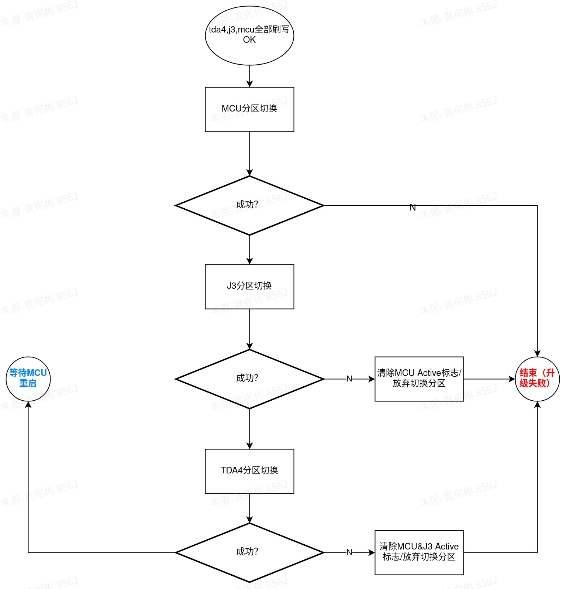
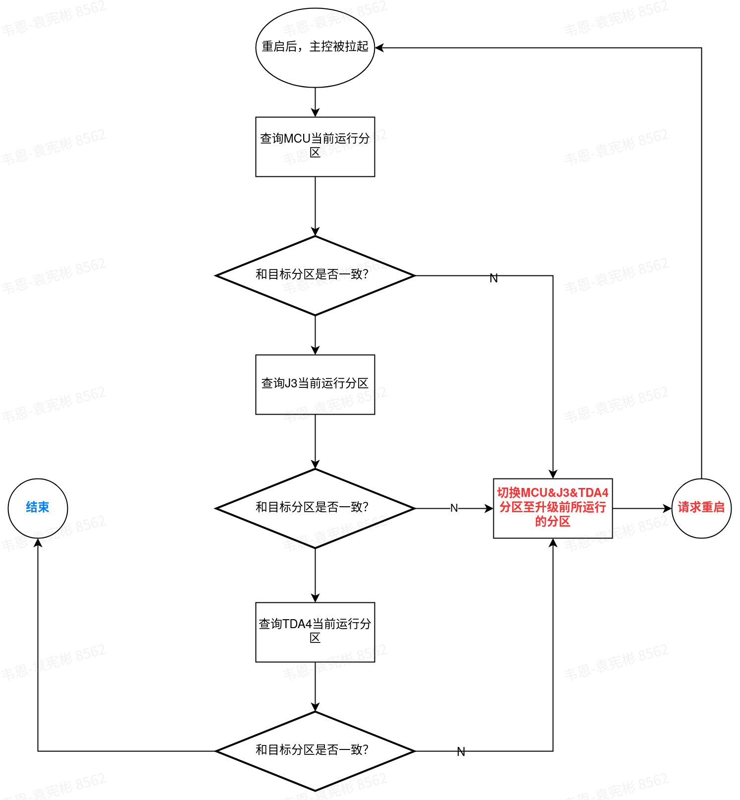

# 运行面切换方案

**前置条件**

ADCC控制器出厂时需要确保TDA4&J3&MCU同处相同面 A OR B

ADCC控制器出厂时需要确保A/B面程序运行正常

不论是全量升级亦或差分升级，每次升级时都需要升级所有Chip

**ADCC刷写方式**

并行刷写

**场景一：ADCC在刷写结束，重启之前请求切换运行面**

**场景二：ADCC在重启后CHECK所有芯片当前运行面信息**

