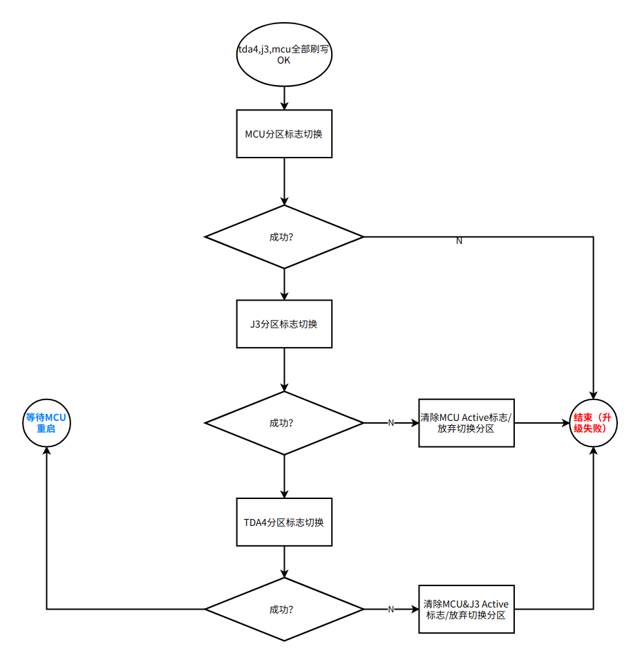
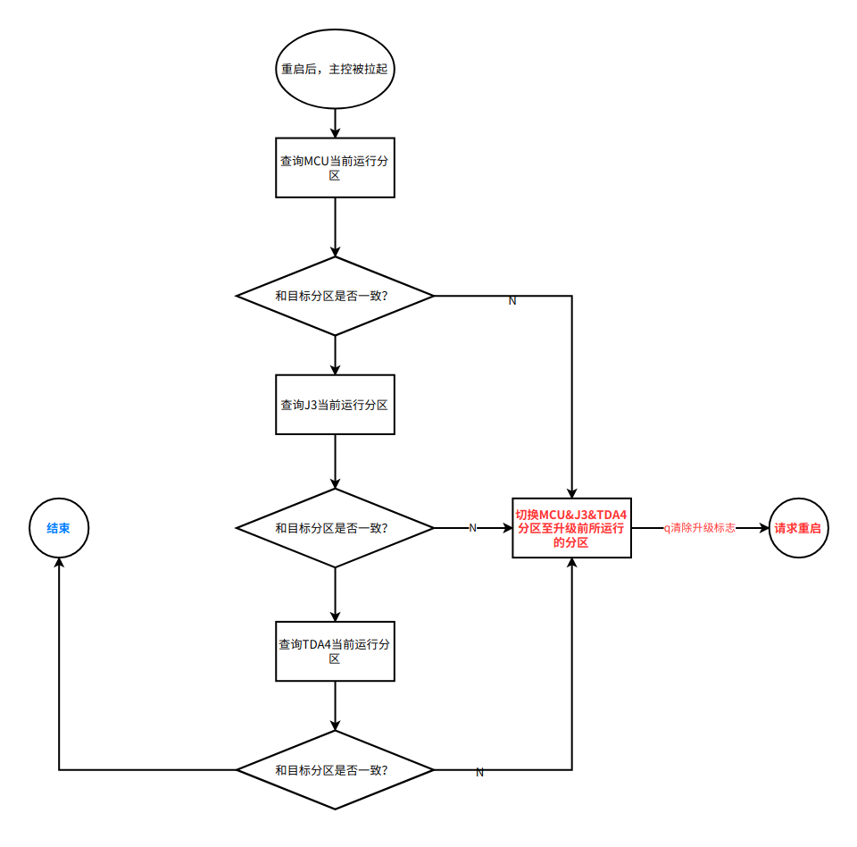
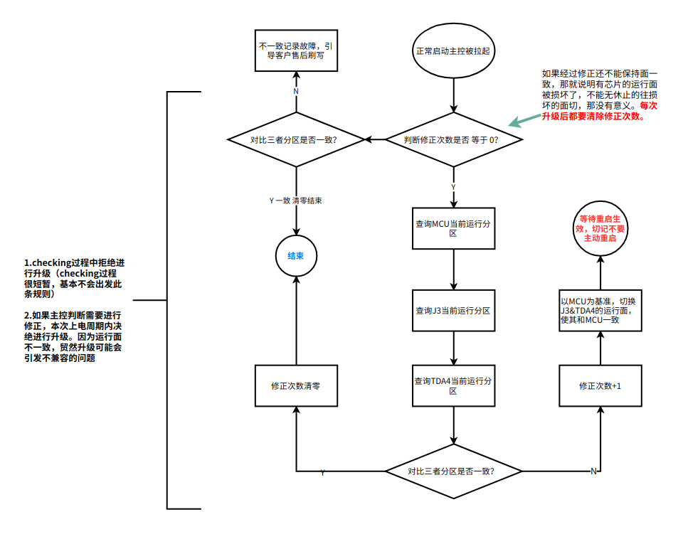

# QH01-ADCC OTA运行面切换方案

**前置条件**

ADCC控制器出厂时需要确保TDA4&J3&MCU同处相同面 A OR B

ADCC控制器出厂时需要确保A/B面程序运行正常

不论是全量升级亦或差分升级，每次升级时都需要升级所有Chip

**ADCC刷写方式**

并行刷写

**场景一：ADCC在刷写结束，重启之前请求切换运行面**

先打印错误信息 不做处理\@库珀-张晓波\@韦恩-袁宪彬

{width="5.75in"
height="6.010416666666667in"}

**场景二：ADCC在重启后CHECK所有芯片当前运行面信息**

只考虑场景二\@韦恩-袁宪彬\@库珀-张晓波

{width="5.75in"
height="5.677083333333333in"}

升级失败的故障码；

暂不实现

**场景三：非升级流程，A B面一致性保证**

-暂不考虑\@韦恩-袁宪彬\@库珀-张晓波

Q1：修正失败后，是否需要记录故障引导客户进行售后刷写？ \-- 需要，增加DTC

注意：售后刷写时，不管3个芯片的运行面是否一致，都要能升级。在升级后，主控再走场景三，确保运行面一致（此时版本有可能不匹配了，该如何处理？再次刷写吗？？）

2023/06/03 15:42 -策略思考\@韦恩-袁宪彬

修正次数等于0时，可以升级。

修正次数等于1，运行面还不一致，记录故障引导用户进行售后刷写。

**点击图片可查看完整电子表格**

修正次数等于1，运行面一致，修正次数清零

{width="5.75in" height="4.53125in"}

**场景四：安全启动校验失败**

**讨论点：**

诊断重启是DM到MCU，OTA 重启走的是
upgradeMgr-\>mcuUpgradeMgr-\>MCU，需要统一 重启路径；

\--和\@艾伦-钱鹏鹏确认后，修改OTA重启路径为upgradeMgr-\>DM-\>mcu

OTA 失败，是否要 ADCC 全部重启；

\--重启

**待办：**

~~确认SoC 仅更新 版本号的情况下，如何从运行面升级到非运行面；~~

ADCC 多芯片协同下电流程梳理；

诊断调查表增加 OTA/刷写失败的故障码
